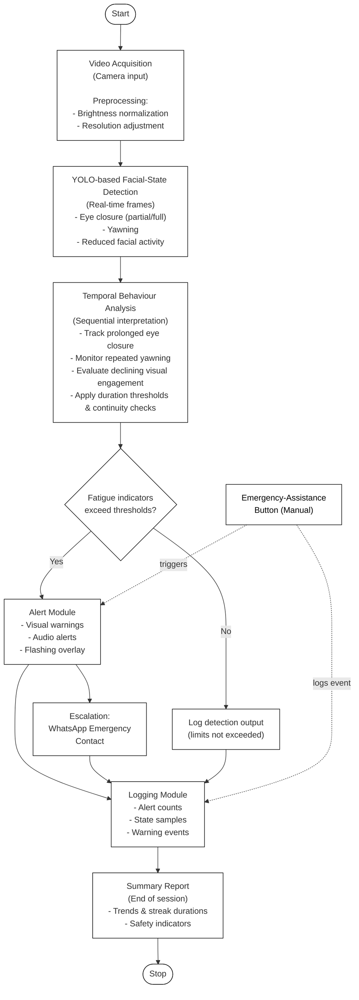

```mermaid
flowchart TD
  %% Flow direction top-down
  classDef box stroke:#000,stroke-width:1px,fill:#fff;
  classDef diamond stroke:#000,stroke-width:1px,fill:#fff,shape:diamond;
  classDef note stroke:#000,stroke-width:1px,fill:#f8f9fa,color:#000;

  Start([Start]):::box

  VA["Video Acquisition\n(Camera input)\n\nPreprocessing:\n- Brightness normalization\n- Resolution adjustment"]:::box

  YOLO["YOLO-based Facial-State Detection\n(Real-time frames)\n- Eye closure (partial/full)\n- Yawning\n- Reduced facial activity"]:::box

  TEMP["Temporal Behaviour Analysis\n(Sequential interpretation)\n- Track prolonged eye closure\n- Monitor repeated yawning\n- Evaluate declining visual engagement\n- Apply duration thresholds & continuity checks"]:::box

  DEC{Fatigue indicators\nexceed thresholds?}:::diamond

  ALERT["Alert Module\n- Visual warnings\n- Audio alerts\n- Flashing overlay"]:::box

  WA["Escalation:\nWhatsApp Emergency\nContact"]:::box

  LOG["Logging Module\n- Alert counts\n- State samples\n- Warning events"]:::box

  REPORT["Summary Report\n(End of session)\n- Trends & streak durations\n- Safety indicators"]:::box

  STOP([Stop]):::box

  LOGOUT["Log detection output\n(limits not exceeded)"]:::box

  EMG["Emergency-Assistance\nButton (Manual)"]:::note

  %% Flow connections
  Start --> VA
  VA --> YOLO
  YOLO --> TEMP
  TEMP --> DEC

  DEC -- Yes --> ALERT
  ALERT --> WA
  ALERT --> LOG
  WA --> LOG

  DEC -- No --> LOGOUT
  LOGOUT --> LOG

  LOG --> REPORT
  REPORT --> STOP

  %% Emergency button behavior: triggers alert & logs immediately
  EMG -. triggers .-> ALERT
  EMG -. logs event .-> LOG

  %% small layout hints (optional)
  class Start,VA,YOLO,TEMP,ALERT,WA,LOG,REPORT,LOGOUT,STOP,EMG box;

```
